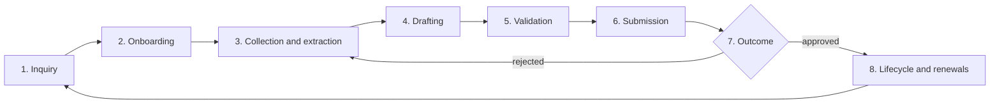

# EzVisa — Orchestration: how the pieces work together

**Version:** 0.1 · **Date:** 2026-10-01
Companion to [01-business-plan.md](01-business-plan.md). This document answers "how do lead intake, AI paperwork, status tracking, Namtarn's knowledge and extra staff fit into one machine?"

---

## 1. Principles

1. **The case is the unit of work.** A client can have several cases (Non-B visa, work permit, bank account). Everything hangs off the case: checklist, documents, forms, tasks, deadlines, audit log.
2. **Playbooks hold the requirements, not people.** A playbook is a versioned, dated definition of a case type at a given immigration office: required documents, forms, fees, timeline, validation rules, known failure modes, wording snippets. Namtarn edits playbooks; the system applies them.
3. **AI prepares, humans decide.** The AI extracts, checks, fills and drafts. A named human approves every pack before it leaves. The AI never submits, never promises an outcome, never advises on evasion.
4. **Every outcome feeds back.** An approval confirms the playbook. A rejection becomes a structured reason and a proposed playbook change, reviewed weekly by Namtarn.
5. **The client always sees three things:** current stage, what is missing, and the next deadline.
6. **Physical work is batched.** Runners go to an office with several validated packs, not one.

---

## 2. Domain model

```
Client ──< Case ──< ChecklistItem ──? Document ──< ExtractedField
             │
             ├──< Form (template, filled data, version, approvals)
             ├──< Task (assignee, due, type: validate | run | chase | review)
             ├──< Event (audit log: who, what, when, before/after)
             ├──< Deadline (90-day report, extension window, WP expiry, re-entry)
             └──> Playbook (case type × office × version, effective from/to)

Playbook ──< RequiredDocument (rules: validity, dating, seasoning, format)
         ──< FormTemplate (PDF/DOCX + field map)
         ──< ValidationRule (cross-document consistency, thresholds)
         ──< WordingSnippet (cover letters, explanations, employer letters)
         ──< KnownFailure (symptom, cause, fix, office, date observed)

KnowledgeEntry (source: case outcome | Namtarn note | regulatory change; office; case type; date; confidence)
```

---

## 3. The case pipeline



| Stage | What happens | AI does | Human does | Exit criterion |
|---|---|---|---|---|
| **1. Inquiry** | Lead arrives from Facebook, LINE, site, referral or partner | Qualifies (nationality, current status and entry stamp, goal, city, timeline, budget); answers FAQs from the knowledge base; picks the playbook; proposes a quote from the price book; flags red flags (overstay, funds shortfall, name mismatch, prior refusals) | Namtarn approves non-standard quotes or declines red-flag cases | Quote accepted |
| **2. Onboarding** | Client pays deposit, accepts privacy notice and terms, receives portal or LINE link | Generates the personalised checklist from the playbook; explains each item in plain language (client's language); sets target dates | — | Client has the checklist |
| **3. Collection and extraction** | Client uploads documents, or a validator scans originals | Reads passports, stamps, bank books, statements, letters, leases, company papers; fills the client profile; cross-checks names, numbers and dates across documents; checks validity rules (passport months remaining, bank letter age, deposit seasoning, photo spec, TM.30 done); chases the client with specific asks, not "send more documents" | Validator resolves flags and answers questions the AI cannot | Checklist 100% green |
| **4. Drafting** | Submission pack generated | Fills forms (TM.7, TM.47, TM.30, TM.8, work-permit forms, e-Visa fields, bank forms); drafts letters from the wording library; assembles the pack in the office's preferred order; produces a one-page "officer view" summary of the case; lists low-confidence fields | — | Pack generated |
| **5. Validation** | Human quality gate | Shows filled fields side by side with the source document crop; highlights every low-confidence field; blocks approval until each is confirmed | Validator confirms and signs. Namtarn signs for risky or first-of-kind cases. Client clicks "my details are correct" | Approved pack, client confirmation |
| **6. Submission** | Appointment or walk-in, by runner, Namtarn or the client | Books online slots where they exist; prints the day's pack list; groups cases by office into one trip; prepares the runner's checklist | Runner submits, uploads receipt or stamp, logs outcome and officer remarks on mobile in under two minutes | Receipt or stamp uploaded |
| **7. Outcome** | Approval, request for more documents, or rejection | Classifies the outcome; on rejection proposes a fix for the client and a candidate playbook change; on approval sets the next deadlines and drafts the next-steps message | Namtarn reviews playbook changes weekly | Case closed or looped back to stage 3 |
| **8. Lifecycle** | Recurring compliance and renewals | Reminders at the right offsets (90-day report window, extension window opening, work-permit expiry, re-entry permit before travel, TM.30 on address change); opens the next case automatically for members | Validator executes recurring tasks; runner batches them | Ongoing |

---

## 4. Human-in-the-loop rules

**What the AI may do on its own**

- Message the client using approved templates: checklist, reminders, "we received X", "still missing Y because Z".
- Draft any document, form or message for a human to approve.
- Propose a quote from the price book for standard cases.

**What always needs a human**

- Any submission to any authority.
- Any non-standard quote or discount.
- Any statement about likelihood of approval.
- Anything touching financial evidence (bank letters, statements, deposits): two humans, not one.

**Escalation to Namtarn, always**

- Overstay, criminal record, funds shortfall, name or date mismatch across documents.
- First case of a new type or at a new office.
- Any officer pushback or request outside the playbook.
- A client asking for anything that resembles document manipulation. The answer is a documented refusal.

**Confidence gates.** Every extracted field carries a confidence score and a link to the source crop. Fields below the threshold are highlighted and must be individually confirmed by the validator before the pack can be approved.

---

## 5. Knowledge base and learning loop

**What goes in**

- Namtarn's templates and wording, collected in weeks 1 to 2 and refined over time.
- Per-office quirks: document order, queue behaviour, what a given office asks for beyond the official list, opening hours, appointment systems.
- Case outcomes, anonymised: accepted or not, what was asked, what was changed.
- Regulatory changes with effective dates and sources.

**How it gets captured without slowing anyone down**

- After every submission the runner answers five fixed questions on mobile: accepted? what did the officer ask for? anything they wanted formatted differently? queue time? free note.
- After every rejection the validator records a structured reason (missing document, wrong format, dating, financial evidence, eligibility, other) plus the fix.
- Once a week, Namtarn spends 30 minutes reviewing proposed playbook changes. Accepted changes create a new dated playbook version.

**How it gets used**

- Retrieval filtered by case type and office when the AI drafts, checks or answers a client question. Every answer cites the entry it came from.
- Entries older than six months without reconfirmation are flagged stale and shown with a warning.
- A weekly regulatory scan (Immigration Bureau, MFA e-Visa portal, Department of Employment, BOI, reputable agent blogs) produces a short changelog and a list of affected playbooks for Namtarn to confirm.

---

## 6. System architecture (proposed, this monorepo)

| Layer | Proposal | Why |
|---|---|---|
| `apps/web` | Next.js (TypeScript). Ops dashboard: case board by stage, case view, validation view with side-by-side crops, runner mobile view. Client portal: status, checklist, upload, pay, chat | One codebase, role-based views |
| `apps/worker` | Background jobs (queue): extraction, form filling, pack assembly, reminders, regulatory scan | Keep long AI calls off the request path |
| `packages/playbooks` | Declarative case-type definitions (YAML or TypeScript) with per-office overrides and effective dates | Namtarn's requirements as data, versioned in git |
| `packages/forms` | PDF templates with field maps, DOCX letter templates, Thai and Latin fonts | Deterministic fills from structured data; the AI supplies data, code fills the PDF |
| `packages/ai` | Anthropic SDK. Default model `claude-opus-5-5` for extraction, cross-checks, drafting and outcome classification, with structured outputs for field extraction and PDF/image input for documents. Prompt caching on playbooks and wording. Message Batches for nightly re-checks of open cases. Server-side fallbacks enabled | One model, one cache namespace; measure before adding a cheaper model for bulk extraction |
| Data | Postgres (Prisma), private object storage with signed URLs and encryption at rest, Redis for queues | Fits the existing tooling |
| Messaging | LINE Messaging API, Meta Messenger, WhatsApp via Twilio, email | Meet clients where they already are; LINE is the Thai default |
| Payments | PromptPay QR, card via Omise or Stripe | Deposit at case open, balance before submission |
| Hosting | Railway, Singapore region | Closest region to Thailand, already in use |
| Security | Roles (admin, senior agent, validator, runner, client), per-document access log, MFA for staff, retention jobs, PDPA consent records, daily backups | Passports and bank statements are the payload |

**AI cost per case** *(estimate)*: a case involves roughly 20 to 30 pages of documents read as images or PDFs, a few cross-check passes, three to five form fills and a handful of drafted messages. That is on the order of 150,000 input tokens and 30,000 to 60,000 output tokens including reasoning. At Opus 5.5 rates (4 USD per million input, 20 USD per million output) this lands between 1.5 and 4 USD, so roughly 50 to 150 THB per case. Lead qualification chats add little because they are short. Prompt caching on the playbooks brings the input side down further.

---

## 7. MVP scope and non-goals

**MVP, weeks 3 to 6**

- Three playbooks: Namtarn's top three case types at Chiang Mai Immigration.
- Case board, client profile, checklist engine.
- Upload plus AI extraction with confidence scores and source crops.
- Pre-fill for three to five forms, pack export as a single PDF in office order.
- Client status page (read-only) with what is missing and next deadline.
- Reminders by LINE or email.
- Audit log of every approval.

**Explicitly not in the MVP**

- Payment automation, membership billing, lead-generation workflow, multi-office playbooks, runner routing, other agents on the platform.

**Success criteria for the MVP** *(measured on Namtarn's live cases)*

- Namtarn's hands-on hours per case cut by at least half.
- First-time acceptance rate at or above her current rate, ideally higher.
- Zero cases where the client did not know what was missing.

---

## 8. Worked example: retirement extension, Chiang Mai

*(Illustrative; the real checklist comes from Namtarn's playbook.)*

| Day | Step |
|---|---|
| 0 | Inquiry via Facebook. AI qualifies: 62, UK passport, on Non-O, extension due in 40 days, bank deposit seasoned. Quote proposed and accepted, deposit paid. |
| 0 | Checklist generated: passport with entry stamp and current extension, TM.6 or TDAC record, bank book plus 12-month statement, bank letter dated within the office's window, photos to spec, TM.30 receipt, lease, TM.7 to be pre-filled, 1,900 THB fee. |
| 1 – 4 | Client uploads. AI flags: bank letter missing, photo background wrong, name spelling differs between lease and passport. Client receives three specific asks. |
| 5 | All items green. TM.7 pre-filled, cover note drafted from the wording library, pack assembled in the order Chiang Mai Immigration expects, bank-letter appointment booked for day 6. |
| 6 | Validator confirms four low-confidence fields against crops and signs. Client clicks "my details are correct". |
| 7 | Runner submits three retirement extensions in one trip. Logs: accepted, officer asked for a second copy of the statement (playbook change proposed). |
| 7 | Deadlines set: 90-day report in 90 days, next extension window opens in ~11 months. Membership offer sent. |
